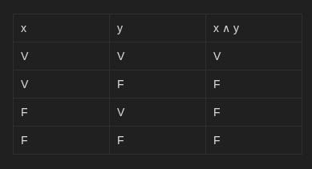
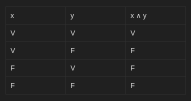

1.

Proposições:

x: Estudei para a prova
y: Fiz todos os exercícios

Conectivo:

E (∧)

Tabela Verdade:

2.

Proposições:

x: Vou ao cinema
y: Fico em casa assistindo séries

Conectivo:

OU (∨)

Tabela Verdade:

3.

Proposições:

x: Eu acordar cedo
y: conseguirei pegar o onibus

Conectivo:

SE ENTÃO (→)

Tabela Verdade:

obs: Se x não foi prometido, y pode ser falso ou verdadeira, independe

4.

Proposições:

x: Estudar muito
y: Passarei na prova
w: ganherei um presente

Conectivo:

E (∧)
SE ENTÃO (→)

Tabela Verdade: 

5.

Proposições:

x: vou jogar videogame
y: vou estudar lógica de Programação

Conectivo:

OU (∨)

Tabela Verdade:

6.

Proposições:

x: Eu comi pizza
y: tomei refrigerante

Conectivos:

E (∧)

Tabela Verdade:

7.

Proposições:

x: eu tiver dinheiro
y: viajarei de férias

Conectivos:

SE ENTÃO (→)

Tabela Verdade:

8.

Proposições:

x: Eu lerei um livro
y: terminar meu trabalho

Conectivos:

SE E SOMENTE SE (↔)

Tabela Verdade:

9.

Proposições:

x: estiver sol
y: irei à praia
w: ao parque

Conectivos: 

SE ENTÃO (→)
OU (∨)

Tabela Verdade:

10.

Proposições

x: Eu farei um bolo
y: comprar os ingredientes

Conectivos:

SE E SOMENTE SE (↔)

Tabela Verdade:

